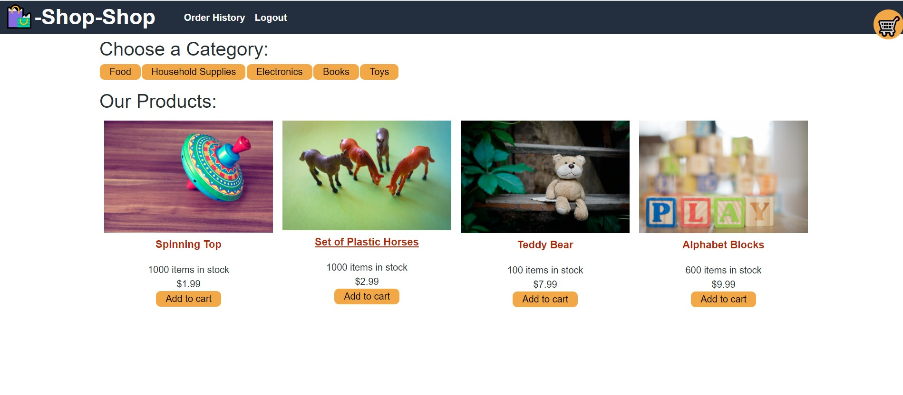
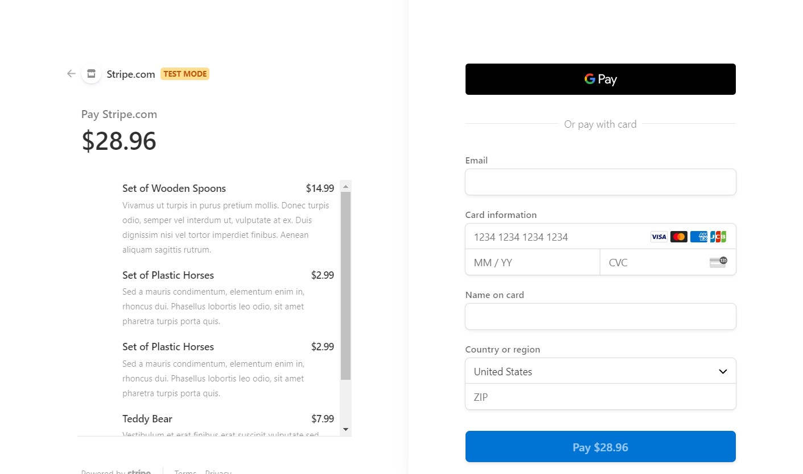

# Shop Shop

## Table of Contents

* [Description](#description)

* [Preview](#preview)

* [Usage](#usage)

* [Contributers](#contributers)

* [Status](#status)

* [Questions](#questions)

## Description

* Shop shop is a Ecommerce platform created for an assignement during my Full Stack coding bootcamp through UC Berkeley.  It uses MongoDB, ExpressJS, ReactJS, NodeJS, and stripe. This assignment was to refactor an existing webpage to have a global state to control the data for the categories, products and shopping cart.  In addition, to the refactor I also added in the abilitiy to check out with stripe and offline capabilities with IndexedDB.

* You can view the deployed site at [https://colossal-closer.herokuapp.com/](https://colossal-closer.herokuapp.com/).

## Preview

* Main Page

* Stripe Checkout 

## Usage

* For development, simply install all dependencies then run `npm run seed`.  Run `npm start` to begin running the application.  

* To use the deployed app, simply visit the webpage create a user and shop.  To simulate a successful purchase, use credit card number 4242 4242 4242 4242. All other fields will work with random information.

## Contributers

I am the Sole contributor for this project

## Status

This project is completed to grading standards.

## Questions

If you have questions about this project, or if you would like to contribute, visit our repo at [GitHub](https://github.com/NGDino/shop-shop Closer) or contact Neil directly at <n.dino90@gmail.com>.